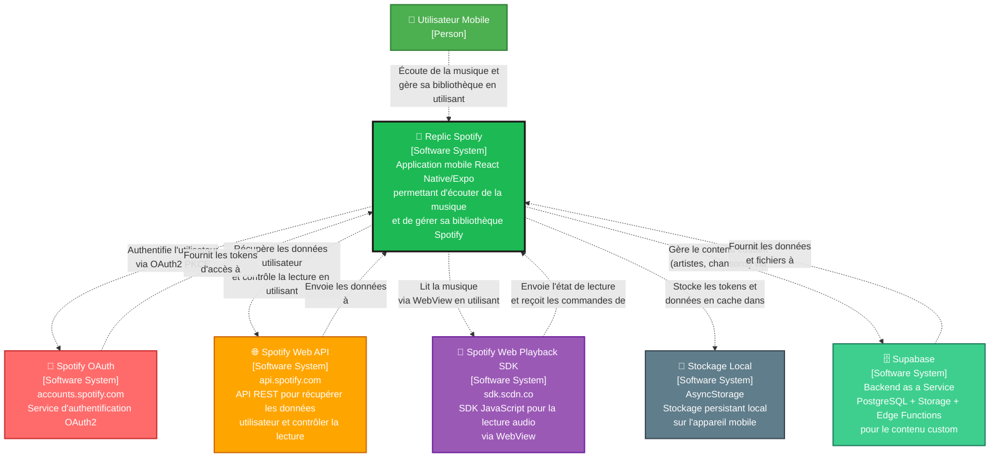

# Diagramme de Contexte Système - Replic Spotify

## Vue d'ensemble

Ce diagramme montre les interactions entre l'application Replic Spotify et les systèmes externes.

## Description des Interactions

### 1. Utilisateur ↔ Application
- **Utilisateur** : Interagit avec l'interface mobile (iOS/Android)
- **Application** : Affiche les écrans, gère la navigation, contrôle la lecture

### 2. Application ↔ Spotify OAuth
- **Authentification** : Flux OAuth2 avec PKCE
- **Endpoints** :
  - `https://accounts.spotify.com/authorize` (autorisation)
  - `https://accounts.spotify.com/api/token` (échange de tokens)
- **Scopes** : Lecture de profil, playlists, historique, contrôle de lecture

### 3. Application ↔ Spotify Web API
- **Données récupérées** :
  - Profil utilisateur
  - Artistes, albums, tracks, playlists
  - Historique de lecture récent
  - Top artists et tracks
  - État de lecture actuel
- **Contrôle** : Lecture, pause, recherche dans la piste

### 4. Application ↔ Spotify Web Playback SDK
- **Lecture audio** : Via WebView intégrée
- **Communication** : Messages bidirectionnels entre React Native et WebView
- **Fonctionnalités** : Lecture, pause, contrôle de position, état du player

### 5. Application ↔ Supabase
- **PostgreSQL** : Stockage des données structurées (artistes, chansons)
- **Storage** : Stockage des fichiers (images, audio)
- **Edge Functions** : Logique serveur pour la création de contenu
- **Row Level Security (RLS)** : Sécurité au niveau des données

### 6. Application ↔ Stockage Local
- **AsyncStorage** : Stockage des tokens d'accès, device_id, et données en cache
- **Persistance** : Maintien de l'état de l'application entre les sessions

## Technologies Utilisées

- **Frontend** : React Native, Expo Router
- **Authentification** : Expo Auth Session (OAuth2/PKCE)
- **API Client** : Fetch API (REST)
- **Lecture Audio** : Spotify Web Playback SDK via WebView
- **Stockage** : AsyncStorage
- **State Management** : TanStack Query (React Query)

---

## Légende du diagramme

- 🟢 Rectangle vert avec icône personne = **Person, Utilisateur**
- 🟢 Rectangle vert = **Replic Spotify** (Système principal)
- 🔴 Rectangle rouge = **Spotify OAuth** (Système logiciel externe)
- 🟠 Rectangle orange = **Spotify Web API** (Système logiciel externe)
- 🟣 Rectangle violet = **Spotify Web Playback SDK** (Système logiciel externe)
- 🟢 Rectangle vert clair = **Supabase** (Système logiciel externe)
- ⚫ Rectangle gris = **Stockage Local** (Système logiciel externe)
- Flèche pointillée = **Relation**

---

**System Context View: Replic Spotify**

Le diagramme de contexte système pour l'application mobile Replic Spotify | Format C4 Model | License: CC BY 4.0

